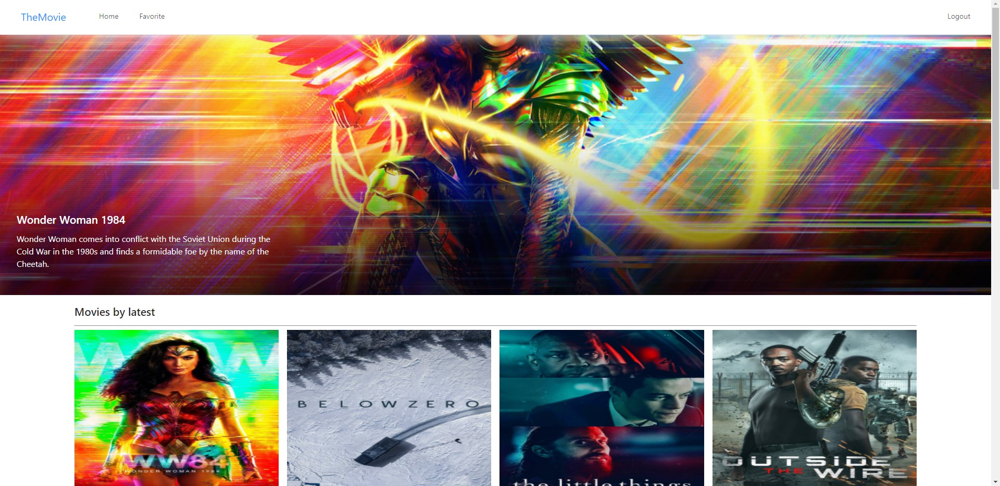
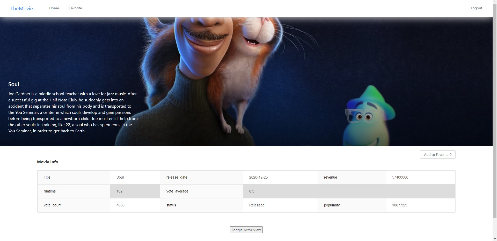

## Start to TheMovie App...

To use this application,

1. make dev.js file inside config folder 
2. put mongoDB info into dev.js file 
3. Type " npm install " inside the root directory   ( Download Server Dependencies ) 
4. Type " npm install " inside the client directory ( Download Front-end Dependencies )

 

---------------------------------------
TheMovie App Image

This project referenced John Ahn's project [react-movie-app-ko](https://github.com/jaewonhimnae/react-movie-app-ko).